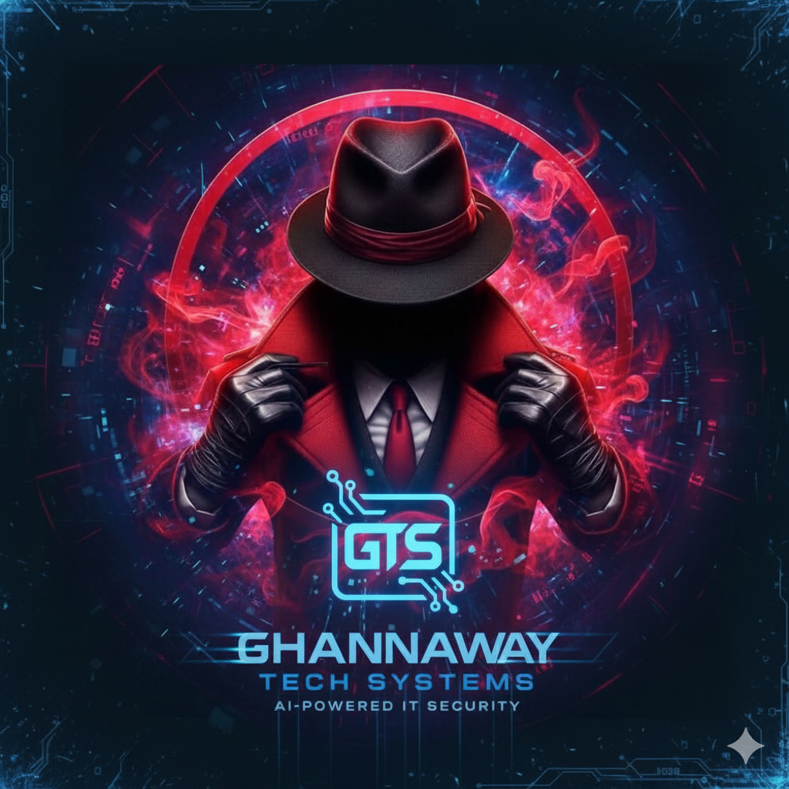

# 👋 Hi, I'm Ghannaway! 

  

---

## 👨‍💻 Software Engineer & Cybersecurity Specialist

Welcome to my GitHub profile!  
I'm passionate about building secure and powerful web and technology solutions.

---

## 🛠️ Tech Stack

  
  
  
  
  

- **Specialties:** Web Development, Cybersecurity, Automation
- **Projects:** Restaurant Menu Web Apps, Tech Tools, Security Solutions

---

## 🚀 My Goals

- 🛡️ Develop robust and secure digital tools
- 🧠 Innovate in technology without interference or compromise
- 🤝 Share knowledge and collaborate to empower others

---

## 📣 Connect with Me

 <!-- Add this if you have a portfolio site -->

---

## 💡 Fun Fact
> “The work of a computer is only as smart as the mind behind it.”  
> — Ghannaway

---

## 📂 Featured Projects

<table>
  <tr>
    <td>
      <a href="https://ghannaway-tech.github.io/Restaurant-menu/green_theme/index.html">
        
         
        <b>Restaurant Menu Web App</b>
      </a>
       Interactive and responsive menu built with HTML, CSS, and JS.
    </td>
    <td>
      <a href="https://github.com/GhannawayTechSystems">
        
         
        <b>Cybersecurity Tools</b>
      </a>
       Scripts and guides to strengthen digital security.
    </td>
  </tr>
</table>

---

  
  
  
  

---

## 🏆 Achievements & Highlights

- 🥇 **Completed 20+ security-focused web projects**
- 📜 **Published guides on web automation and cybersecurity**
- 🌍 **Collaborated with international developer communities**

---

Thanks for visiting!  
Feel free to explore my repositories or reach out for collaboration.

  

